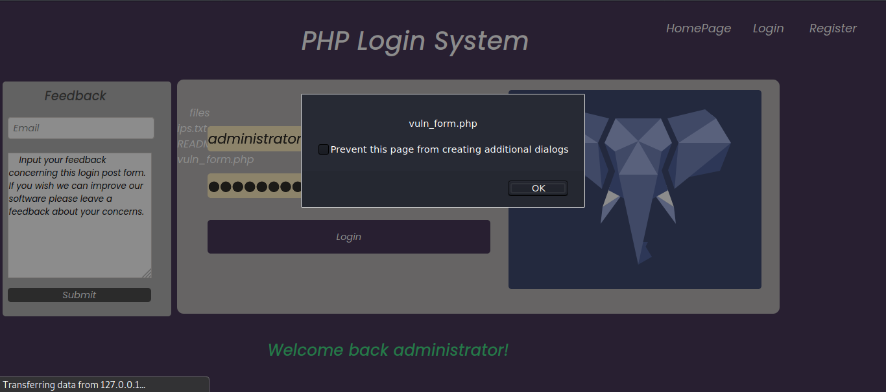

##  Vulnerable-PHP-Form

## What is PHP?
> According to wikipedia, PHP is a general-purpose scripting language geared towards web development. It was originally created by Danish-Canadian programmer Rasmus Lerdorf in 1994. The PHP reference implementation is now produced by The PHP Group.

